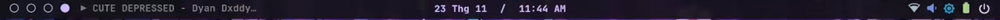

## TODO
- **Macos like bottom bar for apps**
- **Implement dim by overlaying dark screen if screen brightness can't be set or just for extra dim**
- **Jellyfin music integration to directly play music**
- **Google calendar api**
- **if multiple mpris menus then next to eachother with buttons to switch.**
- **replace python materialyoucolor with matugen**

Bar styling I somewhat wanna follow:

menu?

[github](https://github.com/snes19xx/surface-dots) - quickshell