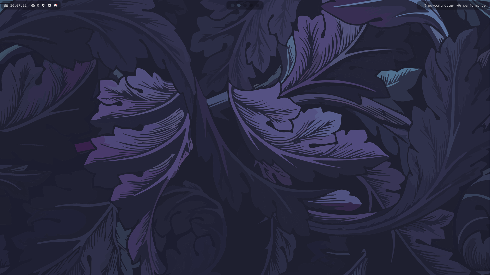
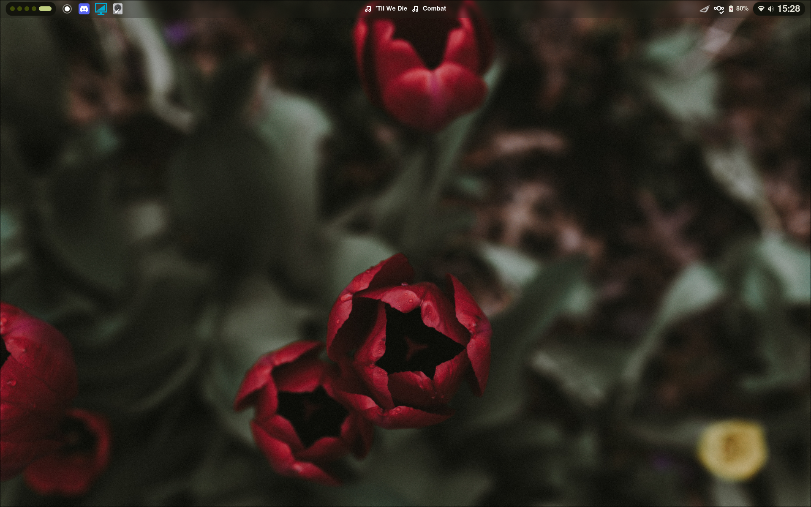

# Mangowc Dotfiles Setup
For the hyprland dotfiles go [here](https://github.com/AlexJonker/linux-dotfiles/tree/Hyprland)



## FEATURES
- **Dual monitor support for waybar**
- **Pywal with waypaper**

## TODO
- **Correct adw-gtk3 theme (both dark now)**
- **[this](https://github.com/eylles/pywal16-libadwaita/issues/10) in the install script**
---

## Installation Guide

### **This is meant to be run on a fresh Arch Linux install!**

### **1. Clone and Run the Install Script**

```bash
# Clone the Hyprland dotfiles repository
git clone https://github.com/AlexJonker/linux-dotfiles --depth 1
cd linux-dotfiles

# Run the install script
bash ./install.sh
```

### **2. Configure Display Settings**

After installation, reboot and run the `post-install.sh` script
```bash
bash ./post-install.sh
```


W.I.P.

